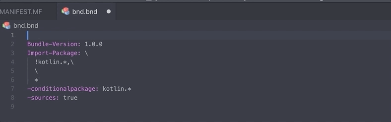

# OSGi for Visual Studio Code

A Visual Studio Code extension that add syntax highlight, auto-completion with snippets to OSGi headers in `MANIFEST.MF` and `bnd.bnd` files.

## Installation

This extension is published in [Visual Studio Code Marketplace](https://marketplace.visualstudio.com/items?itemName=lgdd.vscode-osgi). Please follow the [official documentation](https://code.visualstudio.com/docs/editor/extension-gallery) in order to install it.

## Questions, issues and feature requests

For any question, issue or feature request, feel free to [open an issue on GitHub](https://github.com/lgdd/vscode-osgi/issues).

## License

[MIT](LICENCSE)
